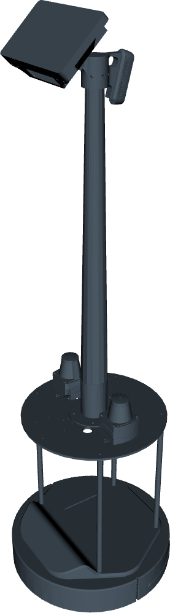
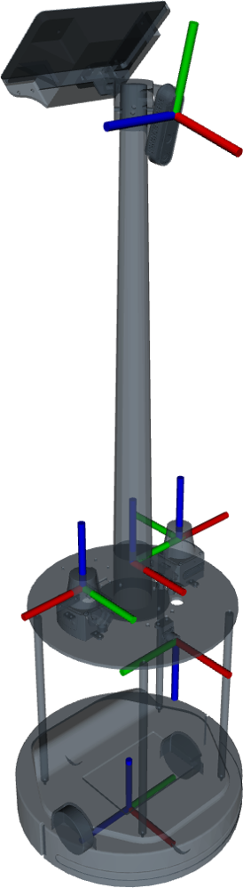

## kugle_sensor_suite_gui

This package was exported from [SolidWorks](https://www.solidworks.com/) by the use of [sw_urdf_exporter](http://wiki.ros.org/sw_urdf_exporter) and provides transformation frames for the robot via [`robot_state_publisher`](http://wiki.ros.org/robot_state_publisher).
Furthermore, mechanical properties as well as the meshes themselves are exported and can be used in a simulation software, such as [GAZEBO](http://gazebosim.org/).

