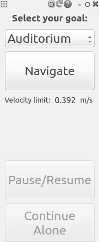

## kugle_sensor_suite_gui

This package provides a simple GUI for the [`guidance`](../guidance/) package developed with [Qt](https://www.qt.io/) as [`rqt`](http://wiki.ros.org/rqt) plugin.

### Plugin

+ [`gui569`](/kugle_sensor_suite_gui/gui.cpp)
	1) Provide GUI for the users
	2) Publish Click and Toggle events from buttons for the use in guidance
	3) Subscribe to maximum velocity limit, goal status and whether a guidee was lost to accommodate the GUI state

